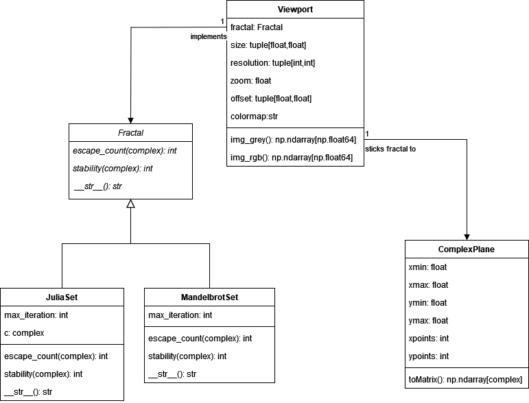
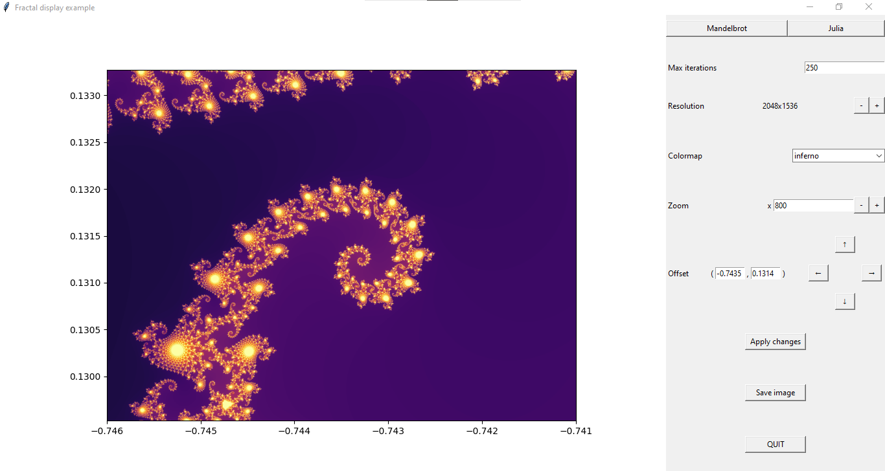

# Python project: Visualizing fractals

This project aims to create a python-based application to draw and visualize complex fractals.

Authors: Agate Comello and Pierre Desbruns.

## Concept of complex fractals

A fractal is a mathematical object characterised by self-similarity, which means the object keeps the same structure regardless of the scale. We could name Koch snowflake, Mandelbrot set or Romanesco broccoli as examples. Those are different types of fractals regarding the way they are generated. The first one, as well as Sierpiński triangle, are based on a geometrical definition, whereas Mandelbrot and Julia sets are based on a algebraic definition.
Whith that being said, what we call complex fractals are fractals that can be defined by an algebraic expression, especially a complex sequence. More precisely, we focus on two fractals that are Mandelbrot and Julia sets. They can be defined as followed:

- Mandelbrot set is the set of complex numbers $c$, such as the sequence $z_{n+1}=z_n^2+c$ with $n$ natural number and $z_0=0$ is bounded.
- Julia sets are the sets of complex numbers $z_0$, such as the sequence $z_{n+1}=z_n^2+c$ with $n$ natural number and $c$ a fixed complex number is bounded.

## Program structure

We divided our code into two parts: backend (fractal generation) and frontend (fractal display and user interface), so that both can be developped separately.

### Backend: fractal generation

The backend program is based on object oriented programming (OOP). The UML diagram is the following:

*Fractal* abstract class allow us to generalize the concept of complex fractal without specifying its type (Mandelbrot or Julia). Since it is an abstract class, it cannot be instanciate. It is a very strong concept of OOP, despite python syntax does not requires it. `escape_count()` is used to return the number of iterations before the term of the sequence becomes to high (modulus of 2 in our case). In other words, this method is a way to measure the speed of sequence divergence. Indeed, to generate fractal, we do not want to only know if the sequence is bounded or not, given a maximum of iterations, but also how does the sequence get bounded or not. `stability()` is only here to normalize the escape count value between 0 and 1, so we can scale it to colormaps.

*MandelbrotSet* class inherits from *Fractal*. It encapsulates the Mandelbrot set concept. It differs from Julia sets inside `escape_count()` according to the definition of the set itself (see above).

*JuliaSet* class also inherits from *Fractal*. It encapsulates the Julia set concept. It differs from Mandelbrot set inside `escape_count()` according to the definition of the set itself (see above). It also differs due to $c$ constant that becomes an input parameter here.

*Plane* class allow us to manipulate a complex plane object without manipulating a whole matrix, so that `toMatrix()` method can only be used when necessary.

*Viewport* class is inspired by [this python tutorial](https://realpython.com/mandelbrot-set-python/). It encapsulates the concept of a window through which an image can be observed with given zoom, size, resolution and offset parameters. In other words, viewport allow us to zoom in/out and move an image without dealing with the image itself. It acts like a kind of screen indide which the image is drawn. `img_grey()` and `img_rgb()` methods really generate the fractal by creating a complex plane and fitting a fractal to it by calculating the stability of each complex point from the sequence.

### Frontend: fractal display

We used a TKinter interface to allow the user to display fractals through different parameters. An example is shown in following picture:

We created a class *GUI* to simplify its use inside code. Since it inherits from Tk() windows, main script can call it as other TKinter windows, regardless whath it is inside.

User can modify fractal parameters such as the number of maximum iterations and $c$ for Julia sets.

User can choose between three resolution: low (640x480), middle (1024x768), and high (2048x1536). Each influences the time of computation. Fractals image format is 4:3.

User can choose among all available matplotlib colormaps.

User can zoom in and out by using buttons (+/-0.5 zoom), or directly by entering the desired zoom value.

User can navigate inside complex plane by using arrows pad, or by entering the center point of interest.

Finally, user can apply changes to generate fractal image, save it and quit.

## File tree

We gathered our files in a package named `fractal_display`, organised as followed:

- `tests`: subpackage containing unit test files for each class.
	- `test_complex_plane.py`: test file for *Plane* class.
	- `test_fractal.py`: test file for *Fractal* abstract class.
	- `test_julia_set.py`: test file for *JuliaSet* class.
	- `test_mandelbrot_set.py`: test file for *MandelbrotSet* class.
	- `test_viewport.py`: test file for *Viewport* class.
- `complex_fractal.py`: module that defines *Fractal*, *MandelbrotSet*, and *JuliaSet* classes.
- `complex_plane.py`: module that defines *Plane* class.
- `gui.py`: module that defines *GUI* class.
- `viewport.py`: module that defines *Viewport* class.

The file `main.py` is the main entry of the program. It provides a basic example of `fractal_display`.
